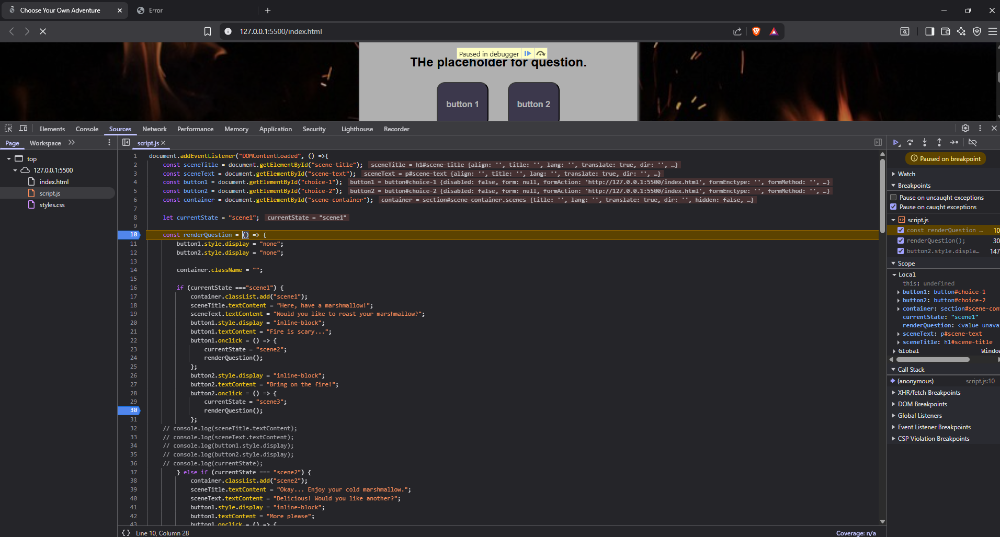
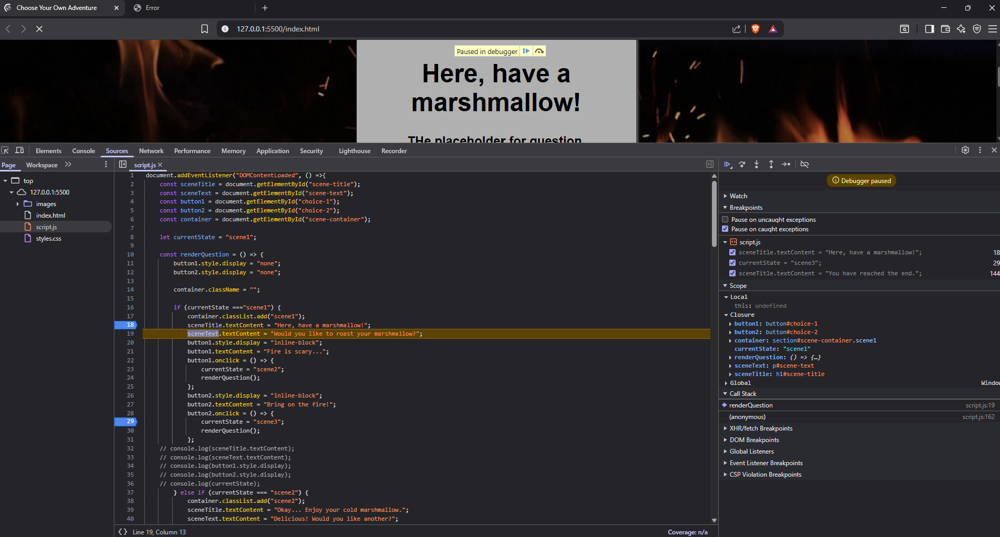
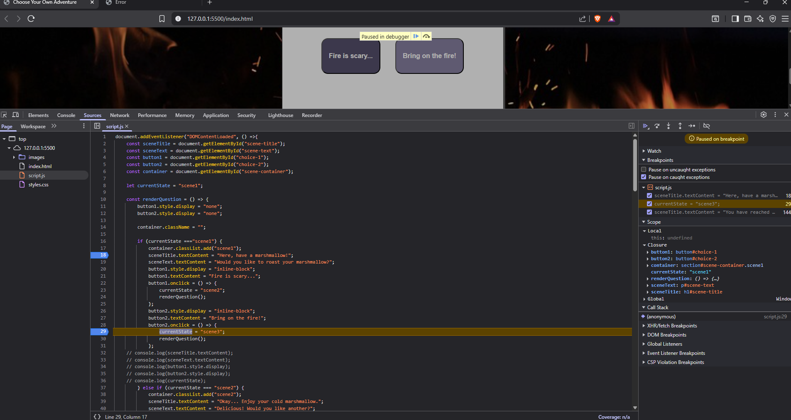
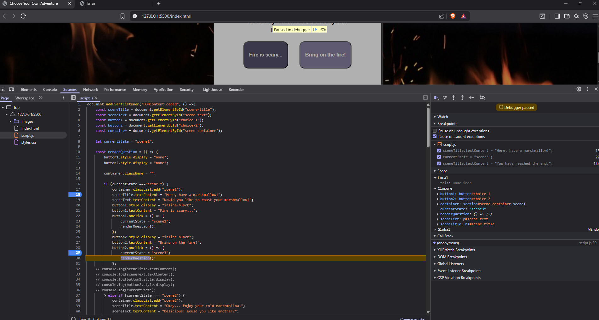
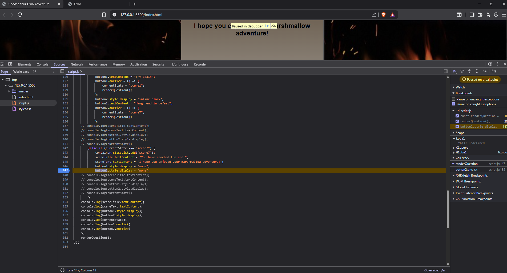
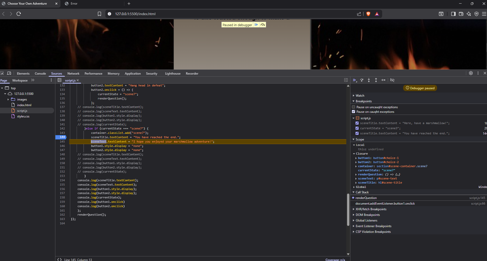

## Identify Logical Breakpoints

Throughout the debugging process, I added three breakpoints to check my
 logic in my js file.

I selected line 18 because it is the first line that updates the scene 
title and text, which marks the start if the scenes display. The current
state started as scene1, and the scene  and text content should have 
been empty before stepping into it. Once stepping into it, the 
Information should change to scene title and text for 
scene1. This would match the expected result for the first scene.

I selected line Line 29 because it reflects the users choice being 
applied to currentState. Seen here it is paused, before stepping through,
the current state should be scene1, after stepping through it should be
updated to scene 3. This would be to show the currentState being updated
following the users choice. 

I selected line Line 144 because it represents the story ending, where 
the user options disappear. Before stepping, the current state is 
scene7, following the step through the scene7s Title content should be
updated to reflect scene7s title and text, but not have choices.

### Is the program behaving as expected at this point? Why or why not?
In this case, I would say it both did and didnt. Though my code has 
been tested through running through the adventure, and runs the way I 
expected it to. I found after 2 hours of attempts that that only 1 of 
my 3 tests allowed me to see said changes in the debuggers scope. This
could be due to user error and no knowing where to properly look for the
changes.

Based on the one that I was able to see, it allowed me to see the 
updated section from one line ot another, showing before, and then 
after the line of code executed where the scope had changes. I could 
see this being helpful to ensure that the code is being executed 
correctly/ outputting the desired change. 
